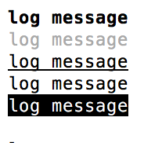
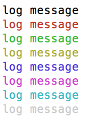

# smart-console

Simple JavaScript library that provides shorthand methods to manage console output with 0 dependencies. Customize your console output with different colors and format styles.

You can find the same library for the browser [here](https://github.com/achille1789/smart-console).

This is our [npm page](https://www.npmjs.com/package/smart-console).

Every console object method (for more info: [Node.js "Console"](https://nodejs.org/api/console.html)) has a name shortcut. Furthermore, predefined colors and style can be added to the log() messages.

## Version 4.0
__New Features:__
* Code completely rewritten with ES6 syntax
* Add new "verbose" method. It is as a normal log but the output, at the beginning, has filename and number  line.
  Any existing log method can be used in verbose mode, just use "v" instead of "l"
  (eg: c.l(text) becomes c.v(text) and c.lRBG(text) becomes c.vRBG(text))
* Add new console methods: clear, count and countReset. Only for node version 8.3.0 or newer
* Add TypeScript definition file
* Add default colors to error, warning and info methods
* Add a new way to insert variables in log
* Add trace method
* "process" object no longer supported

## How to use it:
Insert the library as usual:
```javascript
npm install --save smart-console
```
```javascript
// JavaScript file
const { c } = require('smart-console');

// TypeScript file
import { c } from 'smart-console';
```
Write 'c' instead of 'console' and use one of the method shortcuts. For example:
```javascript
console.log('test');

// Becomes
c.l('test');
```
### Shorthands for console methods
All the shorthand methods use lower case
```javascript
c.a(...extraParams) = console.assert()
c.cl() = console.clear()                        // node >= v8.3.0
c.c([label]) = console.count()                  // node >= v8.3.0
c.cr([label]) = console.countReset()            // node >= v8.3.0
c.dir(object, [optObj]) = console.dir()
c.e(text, ...extraParams) = console.error()
c.i(text, ...extraParams) = console.info()
c.l(text, ...extraParams) = console.log()
c.t([label]) = console.time()
c.te([label]) = console.timeEnd()
c.tr(...extraParams) = console.trace()
c.w(text, ...extraParams) = console.warning()
c.j(object, [space]) = console.log()            // to log stringify objects
c.v(text, ...extraParams) = console.log()       // NEW - to log filename and number line
```

For log() messages you can use 4 different ways to insert a variable:
```javascript
let str = 'Awesome';
c.l('Smart Console is ' + str);
c.l('Smart Console is %s', str);
c.l(`Smart Console is ${str}`);
c.l('Smart Console is', str);       // NEW
```

The method j() can be used to log JS and JSON objects using JSON.stringify
```javascript
var jsonObj = {'pas': 'rex', 'pas1': 'rex', 'pas2': 'rex', 'pas3': 'rex'};
c.j(jsonObj);
// output
// {
//     'pas': 'rex',
//     'pas1': 'rex',
//     'pas2': 'rex',
//     'pas3': 'rex'
// }
var jsObj = {pas: 'rex', pas1: 'rex', pas2: 'rex', pas3: 'rex'};
c.j(jsObj);
// output
// {
//     'pas': 'rex',
//     'pas1': 'rex',
//     'pas2': 'rex',
//     'pas3': 'rex'
// }
```
A second parameter can be added to insert white spaces. By default they are set to 4
```javascript
var jsonObj = {'pas': 'rex', 'pas1': 'rex', 'pas2': 'rex', 'pas3': 'rex'};
c.j(jsonObj, 2);
// output
// {
//   'pas': 'rex',
//   'pas1': 'rex',
//   'pas2': 'rex',
//   'pas3': 'rex'
// }
```

The new method v() "verbose" can be used to log message with filename and line number.
Any log method can be used, just use "v" instead of "l"
```javascript
c.l('Smart Console') becomes c.v('Smart Console')
c.lb('Smart Console') becomes c.vb('Smart Console')
c.lM('Smart Console') becomes c.vM('Smart Console')
c.lMBG('Smart Console') becomes c.vMBG('Smart Console')
// output
// [File: path/file_name] [Line: 150:10] Text message
```

### Format styles for log() method, for verbose use "v" instead of "l"
Format styles use lower case
```javascript
c.lb() = bold
c.lf() = faint
c.lu() = underline
c.ll() = blink
c.ln() = negative
c.lh() = hidden
```


### Colors for log() method, for verbose use "v" instead of "l"
Colors use upper case
```javascript
c.lK() = black
c.lR() = red
c.lG() = green
c.lY() = yellow
c.lB() = blue
c.lM() = magenta
c.lC() = cyan
c.lW() = white
```

### Bold + Colors for log() method, for verbose use "v" instead of "l"
Format styles use lower case and Colors use upper case
```javascript
c.lbK() = bold + black
c.lbR() = bold + red
c.lbG() = bold + green
c.lbY() = bold + yellow
c.lbB() = bold + blue
c.lbM() = bold + magenta
c.lbC() = bold + cyan
c.lbW() = bold + white
```

### Underline + Bold + Colors for log() method, for verbose use "v" instead of "l"
Format styles use lower case and Colors use upper case, bold style is added by default
```javascript
c.luK() = underline + bold + black
c.luR() = underline + bold + red
c.luG() = underline + bold + green
c.luY() = underline + bold + yellow
c.luB() = underline + bold + blue
c.luM() = underline + bold + magenta
c.luC() = underline + bold + cyan
c.luW() = underline + bold + white
```



### Blink + Bold + Colors for log() method, for verbose use "v" instead of "l"
Format styles use lower case and Colors use upper case, bold style is added by default
```javascript
c.llK() = blink + bold + black
c.llR() = blink + bold + red
c.llG() = blink + bold + green
c.llY() = blink + bold + yellow
c.llB() = blink + bold + blue
c.llM() = blink + bold + magenta
c.llC() = blink + bold + cyan
c.llW() = blink + bold + white
```

### Background Color + Bold for log() method, for verbose use "v" instead of "l"
Background Colors use upper case, bold style is added by default
```javascript
c.lKBG() = background color + bold + black
c.lRBG() = background color + bold + red
c.lGBG() = background color + bold + green
c.lYBG() = background color + bold + yellow
c.lBBG() = background color + bold + blue
c.lMBG() = background color + bold + magenta
c.lCBG() = background color + bold + cyan
c.lWBG() = background color + bold + white
```


__Different console colors produce different effects and contrasts__


__If you forget the shortcuts' name:__
```javascript
c.l(c);  // console methods
```

[Git Hub Repository](https://github.com/achille1789/smart-console-nodejs)

[Report an Issue](https://github.com/achille1789/smart-console-nodejs/issues)

[](https://github.com/achille1789/smart-console-nodejs/blob/master/LICENSE)
