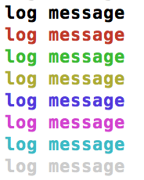
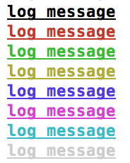
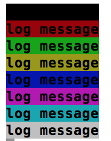

# smart-console

Simple JavaScript library that provides shorthand methods to manage console output with 0 dependencies. Customize your console output with different colors and format styles. Started to implement shorthands for Process Object.

You can find the same library for the browser [here](https://github.com/achille1789/smart-console).

This is our [npm page](https://www.npmjs.com/package/smart-console).

Every console object method (for more info see: [MDN](https://developer.mozilla.org/en/docs/Web/API/console) and
[Google API](https://developers.google.com/web/tools/chrome-devtools/console/console-reference)) has a name shortcut. Furthermore, predefined colors and style can be added to the log() messages.

## Version 3.0
__New Feature:__ In this version I started to implement shorthands for Node.js Global [Process Object](https://nodejs.org/api/process.html#process_process).

## How to use it:
Insert the library as usual:
```javascript
npm install --save smart-console
```
```javascript
const {c, p} = require("smart-console");
```
Write 'c' instead of 'console' and use one of the method shortcuts. For example:
```javascript
console.log('test');
```
Becomes:
```javascript
c.l('test');
```
### Shorthands for console methods
All the shorthand methods use lower case
```javascript
c.a() = console.assert()
c.dir() = console.dir()
c.e() = console.error()
c.i() = console.info()
c.l() = console.log()
c.p() = console.profile()
c.pe() = console.profileEnd()
c.t() = console.time()
c.te() = console.timeEnd()
c.w() = console.warn()
c.j() = console.log() for logging JavaScript JSON objects
```


For log() messages you can use 3 different ways to insert a variable:
```javascript
let str = "Awesome";
c.l("Smart Console is " + str);
c.l("Smart Console is %s", str);
c.l(`Smart Console is ${str}`);
```

The new method j() can be used to log JS and JSON objects using JSON.stringify
```javascript
var jsonObj = {"pas": "rex", "pas1": "rex", "pas2": "rex", "pas3": "rex"};
c.j(jsonObj);
{
    "pas": "rex",
    "pas1": "rex",
    "pas2": "rex",
    "pas3": "rex"
}
var jsObj = {pas: "rex", pas1: "rex", pas2: "rex", pas3: "rex"};
c.j(jsObj);
{
    "pas": "rex",
    "pas1": "rex",
    "pas2": "rex",
    "pas3": "rex"
}
```
A second parameter can be added to insert white spaces. By default they are set to 4
```javascript
var jsonObj = {"pas": "rex", "pas1": "rex", "pas2": "rex", "pas3": "rex"};
c.j(jsonObj, 2);
{
  "pas": "rex",
  "pas1": "rex",
  "pas2": "rex",
  "pas3": "rex"
}
```

### Process object
Implemented shorthand for the methods: abort(), cpuUsage(), cwd(), hrtime().
```javascript
p.a = process.abort()
p.cpu = process.cpuUsage([optional param])
p.cwd = process.cwd()
p.h = process.hrtime([optional param])
```

```javascript
Example:
var time = p.h();
for (let i = 0; i < 2000000000; i++) {
    let loop = i;
}
var diff = p.h(time);
c.l(`Benchmark took ${diff[0]} seconds`);
c.l(`Benchmark took ${diff[0] * 1e9 + diff[1]} nanoseconds`);
Result:
Benchmark took 3 seconds
Benchmark took 3568764113 nanoseconds
```

### Format styles for log() method
Format styles use lower case
```javascript
c.lb() = bold
c.lf() = faint
c.lu() = underline
c.ll() = blink
c.ln() = negative
c.lh() = hidden
```


### Colors for log() method
Colors use upper case
```javascript
c.lK() = black
c.lR() = red
c.lG() = green
c.lY() = yellow
c.lB() = blue
c.lM() = magenta
c.lC() = cyan
c.lW() = white
```

### Bold + Colors for log() method
Format styles use lower case and Colors use upper case
```javascript
c.lbK() = bold + black
c.lbR() = bold + red
c.lbG() = bold + green
c.lbY() = bold + yellow
c.lbB() = bold + blue
c.lbM() = bold + magenta
c.lbC() = bold + cyan
c.lbW() = bold + white
```

### Underline + Bold + Colors for log() method
Format styles use lower case and Colors use upper case, bold style is added by default
```javascript
c.luK() = underline + bold + black
c.luR() = underline + bold + red
c.luG() = underline + bold + green
c.luY() = underline + bold + yellow
c.luB() = underline + bold + blue
c.luM() = underline + bold + magenta
c.luC() = underline + bold + cyan
c.luW() = underline + bold + white
```




### Blink + Bold + Colors for log() method
Format styles use lower case and Colors use upper case, bold style is added by default
```javascript
c.llK() = blink + bold + black
c.llR() = blink + bold + red
c.llG() = blink + bold + green
c.llY() = blink + bold + yellow
c.llB() = blink + bold + blue
c.llM() = blink + bold + magenta
c.llC() = blink + bold + cyan
c.llW() = blink + bold + white
```

### Background Color + Bold for log() method
Background Colors use upper case, bold style is added by default
```javascript
c.lKBG() = background color + bold + black
c.lRBG() = background color + bold + red
c.lGBG() = background color + bold + green
c.lYBG() = background color + bold + yellow
c.lBBG() = background color + bold + blue
c.lMBG() = background color + bold + magenta
c.lCBG() = background color + bold + cyan
c.lWBG() = background color + bold + white
```


__Different console colors produce different effects and contrasts__


__If you forget the shortcuts' name:__
```javascript
c.l(c);  // console methods
c.l(p);  // process methods
```

[Git Hub Repository](https://github.com/achille1789/smart-console-nodejs)

[Report an Issue](https://github.com/achille1789/smart-console-nodejs/issues)

[](https://github.com/achille1789/smart-console-nodejs/blob/master/LICENSE)
